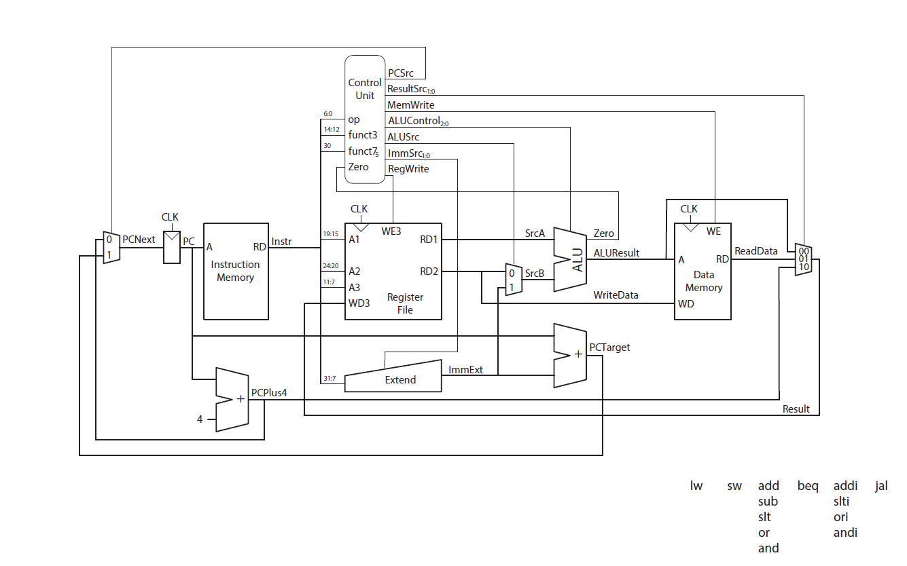
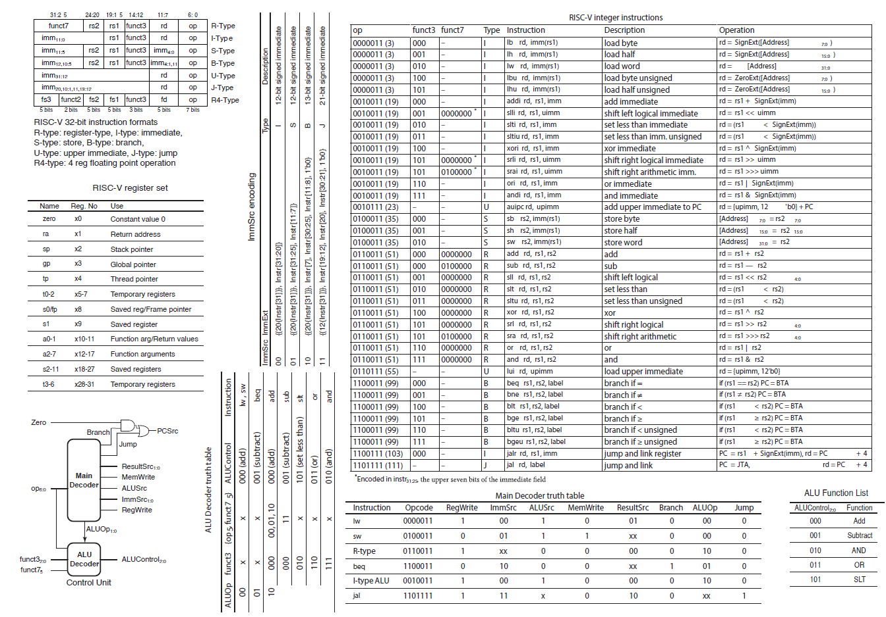

# single-cycle-cpu-risc-v
### English/

A single cycle RISC-V CPU with verilog!!!

single cycle cpu file can do the standart cpu functions like lw, sw, add, sub, slt, or, and, beq, addi, slti, ori, andi and jal.

sra added file is also can be understood by it's name is the sra function added version of the first file

The using instructions photo is right below.

### Turkish/

Verilog ile yapılmış bir single cycle RISC-V CPU.

single cycle cpu dosyası stardart cpu işlemlerini yapabilir: lw, sw, add, sub, slt, or, and, beq, addi, slti, ori, andi and jal

sra added file ise ilk dosyadaki kodun sra fonksiyonu eklenmiş halidir.

Kullanım kılavuzu fotoğrafı hemen aşağıda.

